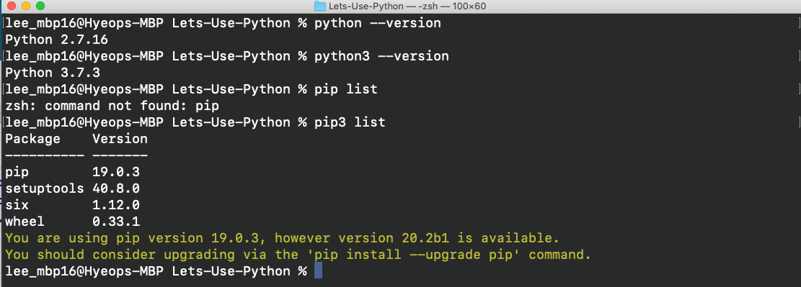

# What Is Python

Python is a powerful and easy to learn language. You can learn more about it and its history on their website Python.org, but we are here to learn about using Python.

Python:
  - Is a high-level language
  - Is an interpreted language
  - Is dynamically typed
  - Is garbage-collected
  - Can do procedural programming
  - Can do object-oriented programming
  - Can do functional programming

## Python Environments

Like other languages, Python has different versions too. Depending on what system you're on, you may or may not already have Python installed. For example, my Mac already came with Python 2.7.16 and Python 3.7.3. You can easily check by going into your terminal and typing:
```
python --version #this prints "Python 2.7.16"

and/or

python3 --version #this prints "Python 3.7.3"
```
If you don't have it installed, it may ask you to install it. Regardless, we want to install the latest version of Python so we'll walk through this part together (sort of).

There are multiple ways to use python and it can get confusing. The simplest way I found to use it is via the terminal. All of my professors have recommended using something called "Python environments". Long story short, it allows for version and package control. For example, you build your first application that worked perfect under Python version 2.x.x and X number of different packages with their own version. You can see a list of packages by typing in terminal:
```
pip list

and/or

pip3 list
```
Since then you've worked on different projects that require an updated version of Python 2.x.x and Y number of the X different packages you had before. Some time down the line you try opening your first project again, but you get an error. Somewhere in your list of updates caused a compatibility issue. Now what? I guess you can try to downgrade everything or just burn your laptop and start again.

Python environments (also called virtual environment) are helpful because you can create different instances of an environment (conceptually similar to object oriented programming). In the case for above, you could have created an environment names after the project name of your first application. From there, you do the same for all other projects. Now, whenever you want to run that project, you can simply go into that virtual environment and never worry about compatibility issue.

###### The Solution?

**Python package and environment managers**

Two popular tools are:
  - pip
  - conda

I use conda, more specifically Miniconda. The two options for conda are:
  - Miniconda
  - Anaconda

Both are free to download and use on MacOS/Windows/Linux. For beginners, I recommend using Anaconda because it starts you off with all sorts of packages and it provides a GUI (Anaconda Navigator) to help manage your environments and packages. Miniconda is much more lightweight, installing only a few basic packages and only interacting via terminal. The closest thing I can think of to relate is like using git via GitHub Desktop or terminal. GitHub Desktop simplifies your development workflow by providing a GUI to interact with. Or you could just use git commands in your terminal like you've been doing all this time. For my linux users, it's like using Ubuntu versus Arch Linux.

## Using Python

Let's recap right quick:
  1. You got your terminal (MacOS, Linux), cmd (Windows), Ubuntu terminal (Windows subsystem for linux, download from Windows Store), or an Python IDE
  2. You figured out whether or not to use a python environment. I will be using Miniconda

Okay, here we go from the start:
  1. Here is what my terminal looks like when I run all the commands I mentioned above.
  
