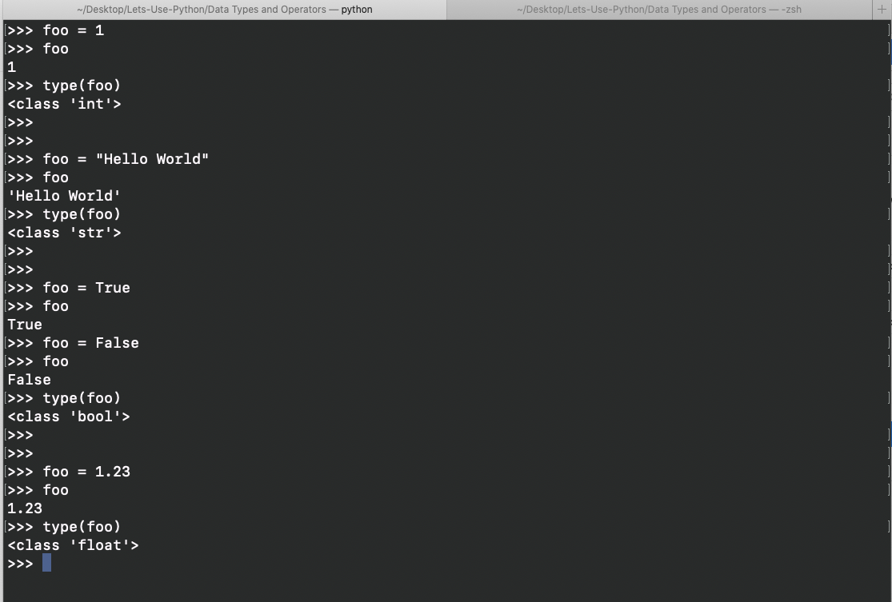
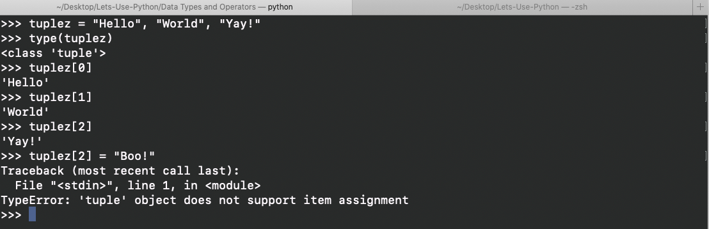

# Data Types

Previously, we learned that Python does not require a data type specification. It's a little rough getting used to not typing your data type every time, but you'll get used to it. Languages that do not need to define its data type are called **Dynamically Typed Languages**.

Python divides its data types into two categories: **Primitive** and **Non-Primitive**. Simple enough, right? Simply put, **Primitive** data types are pre-defined and supported by the programming language. **Non-Primitive** data types are derived from primitive data types but with added functionality.

Primitive data types are stored in stack memory. If you can't recall what stack memory is, then I recommend looking up stack vs heap.

**Primitive Data Types**
```
Integer (int)
String (string)
Boolean (bool)
Float (float)
```

**Non-Primitive Data Types**
```
Lists
Arrays
Tuples
Sets
Dictionary
```

There are more you can add to the list above, but these are the ones we will focus on.

Primitive data types are easy enough, but here is a short example in my Python interpreter:

Note two things here.
1. Because we're not defining the data type for **foo**, we were able to re-assign it a different data type. This is won't work once we go back to the more conventional programming style we're familiar with in C with files and main().
2. Boolean requires cap on the first letter when using True or False, but 1 and 0 also works once the variable has been defined to be a boolean.

Non-Primitive data types are not too much more difficult, but does takes some practice using it. First, let's go over what they are:

**Lists**
- In python, we use Lists instead of Arrays. On the surface, it works almost exactly the same. I believe you CAN import a library to work with Arrays, but I don't see a reason to at this level (one example of this later).
- When people say "use an array" when referencing Python, it's very VERY likely they are actually saying "use a list". This threw me off for the longest time because while they are technically different, they are similar enough that if someone's suggestion to use a List is shot down and you, right after, suggest using an Array, your buddies are gonna look at you funny.
- I like to think that Lists fall in between Arrays and Vectors in C++.
- C++ also has its implementation of a List, but it's not the same as Python so don't get them confused
- **Important!** ~~ Lists are:
  - ordered/random
  - indexed
  - mutable
  - not unique

**Tuples**
- This is honestly my favorite thing about Python coming from C/C++. Tuples are sequences, like a List. I think this is better seen as an example than explained. Just know that, like a List, it holds sequentially an "array or index" of data, but once created it cannot be undone.
- **Important!** ~~ Tuples are:
  - ordered/random
  - indexed
  - immutable
  - not unique

**Sets**
- This one's a bit hard to grasp at first. For now, just know that it's a collection of distinct objects (no duplicates).
- **Important!** ~~ Sets are:
  - unordered/non-random
  - non-indexed
  - mutable
  - unique

**Dictionary**
- Dictionary is a collection of key-valued pairs, almost like your contacts. You have a "key", in this case a contact name, paired with a value, a phone number. To get the value, contact phone number, you search for the key, contact name.
- This is similar to Lists in that the naming conventions throw people off. You may not have heard of Dictionary, but you've probably used it. In C++, Dictionary is called a Map. Again, "technically" they are different but fundamentally similar enough that even my professors have said use a Map when referencing Python.
- However, in Java, both Dictionary and Map exist but they are somewhat different. Regardless, Dictionary is considered obsolete in Java in favor of Map.
- **Important!** ~~ Dictionary's are:
  - ordered/random
  - non-indexed
  - mutable
  - unique

Phew, that was a lot. How's about we go over some definitions to clear those **Important!** lists.
1. **Ordered** - This doesn't quite mean what you may think it means. I'm going to use C++ and array for this:
```
#include <iostream>
// needed for random number generator
#include <cstdlib>
#include <ctime>

using namespace std;

int main()
{
  srand((unsigned) time(0));
  int arr_seq[5];
  int arr_ran[5];

  for (int i = 0; i < 5; i++) {
    arr_seq[i] = i;
    arr_ran[i] = rand() % 5;
  }

  for (int i = 0; i < 5; i++) {
    cout << arr_seq[i] << " ";
  }
  cout << endl;
  for (int i = 0; i < 5; i++) {
    cout << arr_ran[i] << " ";
  }
  cout << endl;
  return 0;
}
```
You can copy and paste the file above if you'd like to test it out, but this should print:
```
0 1 2 3 4
4 0 0 3 4  <--- this sequence is random and will print any number between 0 to 4
```
Which array is Ordered and which one isn't??             
That was a trick question because both are Ordered. Ordered does not mean the values are in order (i.e. ascending or descending). Instead, it means that the values are in the order (or index) you put them in. **Note my use of Ordered vs order.**
For example, for ``arr_seq`` I know that no matter what (until I change the value), ``arr_seq[2]`` will always return ``2`` because that's how I initiated the array in the for loop. Same for ``arr_seq[0]`` equals ``0``, ``arr_seq[1]`` equals ``1``, and etc... Even in ``arr_ran``, while the values were randomly created, once they are in the array, it's order will remain as ``4 0 0 3 4``, therefore it is Ordered even though the values themselves are not in order (ascending or descending).

2. **Random** - If a data structure is Ordered, then it's also Random. Random means that the values are not in order. Conveniently, ``arr_seq's`` values are in ascending order, but the data structure was not responsible for doing that, it was you.

3. **Indexed** - Quite simply, this just means you can return a value based on its index. For simplicity, I like to think of it as any data structures that allows `[#]` on the end of its name. Sets and Dictionary are NOT indexable, meaning that using `[#]` will return an error (although, there is an exception for Dictionary, but that's for later).

4. **Mutable** - This means that you can change the value in a data structure. Of the 4 data structures above, the only one that is **Immutable** is tuples. Once initialized, you cannot change the values in a tuple. For example:


5. **Unique** - This means your data structure cannot have duplicates. Tuples and Lists can have as many duplicates as you want. For example, this is perfectly fine:
```
int arr[10];
for (int i = 0; i < 10; i++) {
  arr[i] = 0;
}
```
However, Sets and Dictionary (Keys, duplicate Values are fine) will not. For this reason it's popular for coding competition. We will dive into some questions that take advantage of their uniqueness properties in our last lesson.

Learn these terms and data structures because they will not go away. I wish my school taught Python in our classes, but we were just threw into projects using Python without actually learning it. The idea is that after a few semesters of Computer Science courses and learning the fundamentals of programming syntax and conventions, you should be able to start learning new languages on your own.

[Next lesson](/Conditional_Statement.md), we're going to dive into conditional statements and its syntactical differences in Python vs C/C++.
