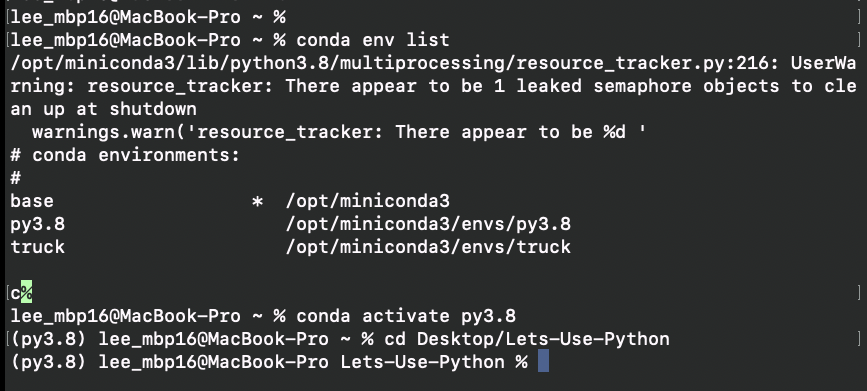
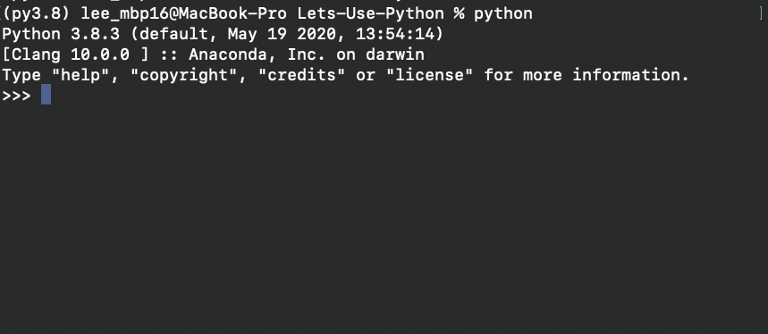
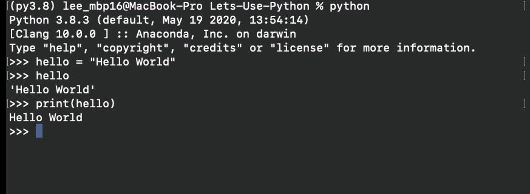
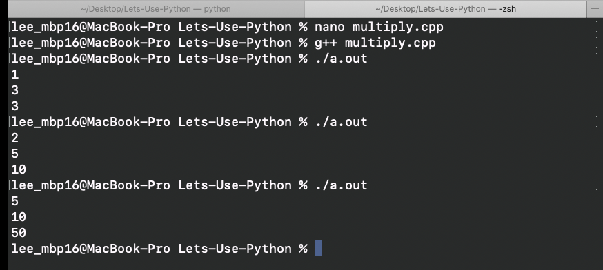
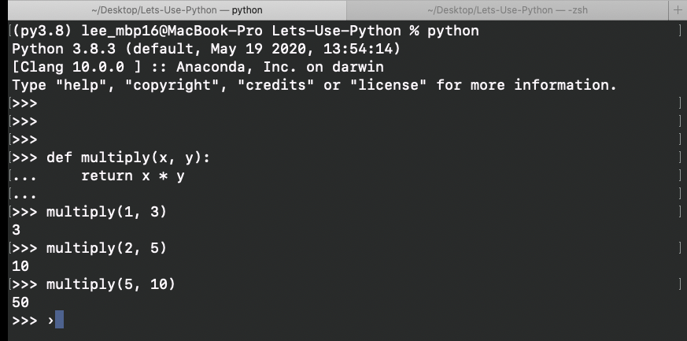

# Using Interpreter

By this point, you should be able to get Python started up and ready to go in just a few seconds.

Quick recap:
- open terminal (or IDE)
- **If you decided to...** activate your python environment of choice
  - You can activate your env at any point. You don't have to go to your directory first, then activate it.



Before we do some coding, let's just quickly understand what a Python interpreter is. Remember that bullet list I had in the beginning?
```
Python:
  - Is a high-level language
  - Is an interpreted language
  - Is dynamically typed
  - Is garbage-collected
  - Is a scripting language
  - Is a programming language
  - Can do procedural programming
  - Can do object-oriented programming
  - Can do functional programming
```

C is a programming language. Python is also a programming language. Hmm.. okay, but Python is also a scripting language.
So if Python == scripting == programming then does that mean it's also == C?
Nope, C is not a scripting language, but rather a compiled language.
Okay, so Python is a programming and scripting language, but did you know it's also a interpreted language? C is not.

This all confused me, in general while studying Computer Science, because every professor defined it differently. The reality of it is that Python is all of the above.

```
                        Programming Language             
                            (Python, C)
                            /         \
             Scripting Language      Compiled Language
                 (Python)               (Python, C)
                /
Interpreted Language
      (Python)
```

This isn't a comprehensive tree, but it gets the point across. So, if you read on job description
```
Experienced in scripting languages
```
You can mark yes!

Okay, so let's get our python interpreter open, just type (depending on your setup):
```
python
or
python3
```
For me, i'm using a conda environment that was set up and upgraded to Python 3.8.3. So for me, it's just **python**. You should have something like this:



This is our editor (for now). So what makes this an interpreted language? The idea is that python does not need to be compiled (like C) before it executes. Behind the scene, it obviously has to compile to machine language from our programming language, but what makes it an **interpreted** language is that **we** don't compile it.

Let's code something right quick. I'll explain it in a bit:



Let's do the same thing in C++ (easier to do than in C because we're working with strings).
1. Create a file - hello.cpp
```
#include <iostream>
using namespace std;

int main()
{
  string hello = "Hello World";
  cout << hello << endl;
  return 0;
}
```
2. Compile the file
```
g++ hello.cpp
```
3. Execute the file
```
./a.out
```
3. It prints:
```
Hello World
```

First, let's admire how much quicker Python was. We didn't need to do anything but create the data and print it. In C++, we had to first create a file, compile it, and execute, then it prints. This why Python is called an interpreted language, because it interprets your code as you type.

Let's step back, our Python code printed **Hello World** twice. The first:
```
>>> hello
'Hello World'
>>>
```
If you type just the variable, it outputs in a list form. The single quotes is indicating that it's a string. Let's try some more:
```
>>> numbers = 123
>>> numbers
123
>>> boolean = True
>>> boolean
True
>>>
```
Int and Bool outputs without single quotes because they are not a string. The second **Hello World** didn't include any quotes. Also the syntax is different. Just like how in our C++ file we had to use **cout** to print on screen the string, Python's syntax is **print(...)**. It doesn't include single quotes like the first print because it's just an output to the screen and not describing the data type.

Speaking of data type, you don't have to specify the data type in Python. Based on what you assign to the variable you created, it'll automatically identify it as such. Let's do some math. In your python interpreter:
```
>>> x = 9
>>> y = 3
>>> z = x + y
>>> print(z)
12
>>>
```
And now, the C++ equivalent:
```
#include <iostream>
using namespace std;

int main()
{
  int x = 9;
  int y = 3;
  int z = x + y;
  cout << z << endl;
  return 0;
}
```
Oops, x is suppose to be 10. Let's fix that, continuing from above:
```
>>> x = 10
>>> z = x + y
>>> print(z)
13
>>>
```
That was easy. It's still easy in C++, but takes way longer. This is a powerful tool to have. For example, you want a program that multiplies two numbers for you. In C++, you need to accept a user input, pass it through to a function, then print:
```
#include <iostream>
using namespace std;

int multiply(int x, int y) {
  return x * y;
}

int main()
{
  int x, y;
  cin >> x >> y;
  cout << multiple(x, y) << endl;
  return 0;
}
```
and our terminal:


Now Python:


Notice how easy that was in python, in both implementation and execution. But, why even go through all that? Just:
```
>>> 1 * 3
3
>>> 2 * 5
10
>>> 5 * 10
50
```
Too easy. Continue to play around and see what else you can do. To quit your interpreter, just type:
```
>>> quit()
or
>>> exit()
```
either will work the same.

Another useful key cmd to know is clearing your python interpreter. Because you are in a interpreter environment, your normal terminal commands like ``clear`` doesn't do anything but give you an undefined error. Instead, try **ctrl + L** and it will clear everything on your screen. This doesn't delete anything. That means everything you've done on the interpreter before clearing it (ctrl + L) will still exist.

That was a simple example of how handy the interpreter can be. A more complex example was when I was developing a website, there was an issue with my database queries. I was using Python with Flask, so I was writing my database queries in Python instead of in a SQL language. It's not easy debugging when you have to compile your project to find an error in one section, so I just typed the queries in the interpreter to see what was happening to the data. This way I was able to isolate where the issue was and correct it.

That's it for this lesson, our [next lesson](../Python%20Basics/Data_Types.md) will go into data types and operators.
