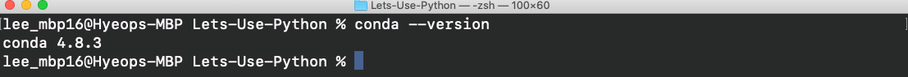
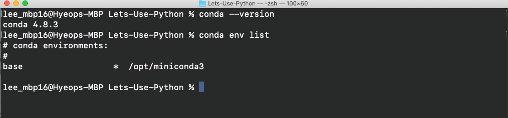
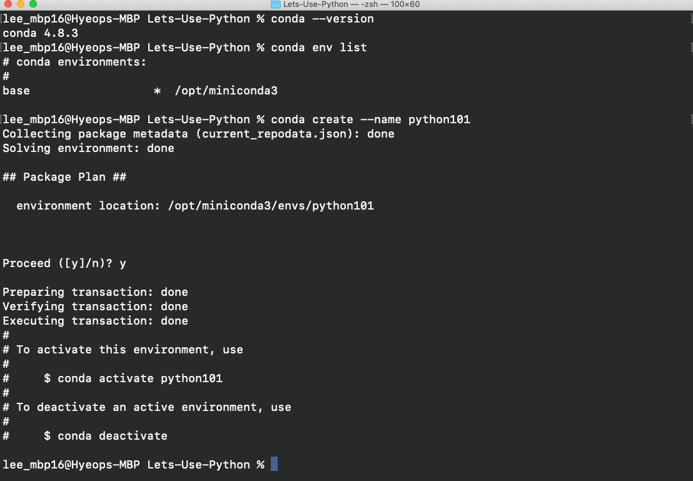
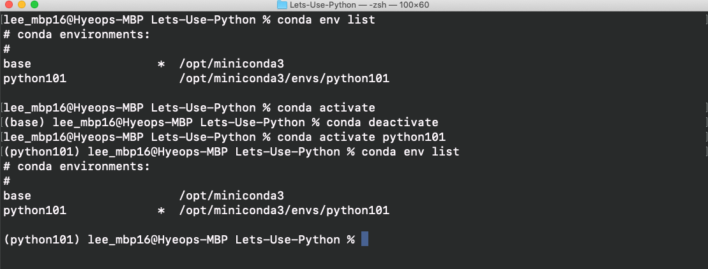

# Using Python

Your results may vary based on what OS and tool you are using. If you are using MacOS(Unix)/Linux/Ubuntu(Windows) terminal, then you should be on par with me. If you are going by other means, your commands may vary but path is the same. Here is what I am working with:

- **MacOS Catalina (v10.15.4)** - You should be find with most of the other MacOS flavors/versions
- **zsh terminal (v5.7.1)** - bash terminal should be perfectly fine. The difference between the two won't matter at all at this level.
- **Miniconda (v4.8.3)** - Anaconda and Miniconda should be exactly the same in the terminal. The only difference will be the Anaconda GUI.

Relevant commands for this lesson:
```
Shell:
bash --version
zsh --version

Conda:
conda --version
# activates default env (base)
conda activate
# replace 'name_of_env' with actual environment name
conda activate name_of_env
conda create --name name_of_env
# replace 'version_number' with actual version like 2.7 or 3.7
conda create --name name_of_env python=version_number
```

## Navigating Conda

This is fairly simple, and conda does provide a command [cheat sheet](conda-cheatsheet.pdf).

1. Let's first confirm conda is installed on your system:
```
conda --version
```


- If you get an output of its version, then you can move on to the next step. If not, consult with Anaconda.

2. Update conda:
```
conda update conda
```
- then `y` to proceed if an update is available.

3. Check what environments you currently have:
```
conda env list
```


- You should only have **base**.

4. Let's create a new environment by typing the command
```
conda create --name python101
```
- If you want to create an environment with a specific python version, then type:
```
conda create --name python101 python=3.5
```
- Of course, that `3.5` can be replaced with any valid version number.


- Type `y` for yes to proceed.

5. We're given the command to activate our new environment, but before we do let's check our `conda env list`.
Note the `*` just before the file path. That indicates what environment is default or you're currently on. Check out what happens below:


- By default, typing
```
conda activate
```
- without specifying what env after *activate* will open **base**. Try it!
The terminal lets you know what environment you're currently on by `(name_of_env)` right before your name.
Now type:
```
conda deactivate
```
- to exit the **base** environment. Next let's specify the env:
```
conda activate python101
```
- Again, type the command  `conda env list` and you'll noticed that the `*` has moved down to **python101**

**And that's it. Whenever you start this tutorial, just open your terminal and type `conda activate name_of_env` and start coding in python.**

## Python Versions

1. Let's get into our environment first, `conda activate python101`.

2. Once you are in your env, check your python version `python --version`. You probably got back `Python 2.7.16`. Try `python3 --version` and you probably got something like 3.7.x. Python 2.7.16 is the last version of python2, so it can't be any other version. However, Python 3.7.x is not the latest version.
3. Let's step back a bit, `conda deactivate`, and go into our **base** env by `conda activate`. Confirm you're in base by looking for **(base)** before your name.
4. Repeat step 2 by first `python --version`. Notice something different? Now try `python2 --version`. So why is **base** default to python3 but our **python101** default to python2.
5. Remember that when we create our python environment, we can specify our python version? Let's give that a shot.
6. Exit the env, `conda deactivate`, and create our 2nd new environment `conda create --name py3.8 python=3.7`.
7. Let's enter our new environment, `conda activate py3.8`, and check our python version again, `python --version`. You should have gotten `python 3.7.x`. Alright, now we're cooking! Just like before, you can specifically ask for python 2 via `python2`.
8. Now, we named our environment **py3.8** but our python version is 3.7.x. Let's update our python, `conda update python`. Check again and you should see `python 3.8.3`. Well at least at the time of writing this, that is the latest python version. Double check by going onto python.org and checking most recent released version for your OS.
9. ~~Lastly, lets delete the **python101** env by `conda env remove --name python101`~~ Hold off on this because there is an [issue](https://github.com/conda/conda/issues/9589) that occurred right after I did step 9.

**This whole portion for Python versions is really just aesthetics. If you're okay with typing 'python3' every time, then that's fine! Go to the [next](Using_Interpreter.md) portion of this lesson**
