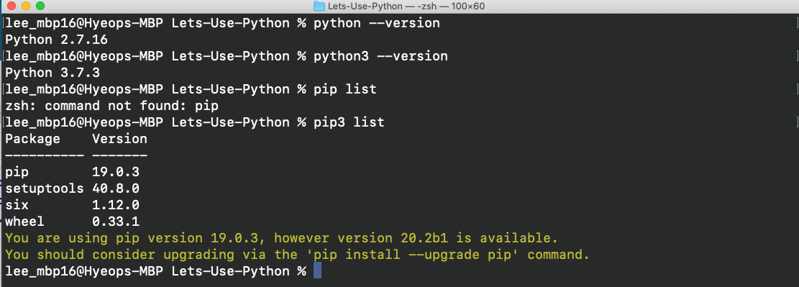

# Lets-Use-Python
For intermediate programmers &amp;&amp; Python beginners.

It helps to know the fundamentals of programming. If you know or started learning C, then that's all the basic knowledge you need to know to get started. That just means I won't stop to explain what data types are, what a header file is, etc.

## Table of Contents

1. **Introduction**
  - [What Is Python](Introduction/What_Is_Python.md)

